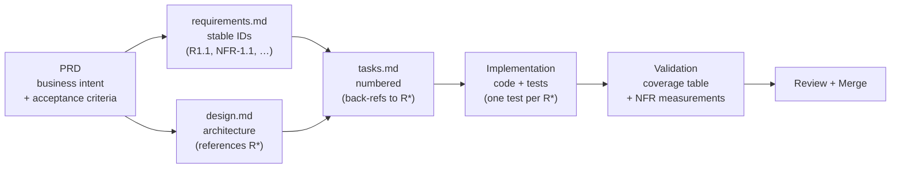

# SpecRoute

**An open-source framework for spec-driven agentic software engineering - vendor-neutral across Claude Code, Codex, Gemini CLI, Kiro, Cursor, and Devin Desktop.**

SpecRoute captures production-grade patterns for PRDs, specifications, prompts, agents, skills, slash commands, hooks, workflows, and engineering rules. It is content, not an application: drop the templates and runtime layouts into your own repo and adapt them to your stack.

## Why spec-driven agentic coding

Agent-assisted development drifts when there is no contract for *what* is being built. SpecRoute formalizes the flow:



<details>
<summary>Text version (if the diagram doesn't render)</summary>

```
PRD (business intent + acceptance criteria)
 ├──> requirements.md (stable IDs: R1.1, NFR-1.1, …)
 │                                                  ──┐
 ├──> design.md (architecture, references R*)         │
 │                                                  ──┤
 │                                                    ▼
 │                                                  tasks.md
 │                                                  (numbered, back-refs to R*)
 │                                                    │
 │                                                    ▼
 │                                                  Implementation
 │                                                  (code + tests; one test per R*)
 │                                                    │
 │                                                    ▼
 │                                                  Validation
 │                                                  (coverage table + NFR measurements)
 │                                                    │
 │                                                    ▼
 │                                                  Review + Merge
```

</details>

Each stage has a template, an agent assignment, and an acceptance criterion. The cross-references that survive across stages - stable requirement IDs, design `Satisfies:` annotations, task back-refs, test back-refs - are what make the agent's output reviewable.

## Core artifact taxonomy

| Artifact | What it is | Lives in |
|---|---|---|
| **PRD** | Business intent, goals, scope, success metrics | `prds/` |
| **Spec** | Requirements + design + tasks (or single feature spec) | `specs/` |
| **Agent** | Defined role + model + tools, invokable by a runtime | `agents/` |
| **Skill** | Interactive parameterized workflow (`SKILL.md` per skill) | `skills/` |
| **Command** | Simple slash-invoked operation, vendor-specific shape | `commands/` |
| **Hook** | Event-triggered automation (file-edit, pre-commit, session-start) | `hooks/` |
| **Prompt** | Reusable prompt - global master, phase master, or task | `prompts/` |
| **Workflow** | End-to-end execution model | `workflows/` |
| **Rule** | Engineering standard, vendor-specific or shared | `rules/` |
| **Runtime** | Copy-pasteable per-vendor layout consumers drop into their own repos | `runtimes/` |

When to reach for which: see [`agentic-docs/automation-decision-framework.md`](agentic-docs/automation-decision-framework.md). For work spanning several specialists, they compose into the **all-hands** orchestration pattern - see [`agentic-docs/multi-agent-orchestration.md`](agentic-docs/multi-agent-orchestration.md).

## Supported vendor matrix

| Vendor | Runtime dir | Root context file | Skills | Agents | Commands | Hooks | MCP config |
|---|---|---|---|---|---|---|---|
| Claude Code | `.claude/` | `CLAUDE.md` [^rootfile] | folder-per-skill `SKILL.md` | flat `<name>.md` + frontmatter | `commands/<name>.md` (merged into skills) | `settings.json` `hooks` (30 events; 5 handler types) [^claudehooks] | `.mcp.json` / `~/.claude.json` |
| Codex | `.codex/` | `AGENTS.md` | folder-per-skill `SKILL.md` | `agents/<name>.toml` | skills (`/skills`, `$mention`) | `hooks.json` or `config.toml [hooks]` (11 events; Claude-compatible names) [^codexhooks] | `config.toml [mcp_servers]` |
| Gemini CLI / Antigravity [^antigravity] | `.gemini/` | `GEMINI.md` (delegation shim) [^rootfile] | `skills/<slug>/SKILL.md` | `agents/<name>.md` | TOML in `.gemini/commands/` | `settings.json` `hooks` (11 events; `Before*` / `After*` names) | `settings.json [mcpServers]` |
| Kiro | `.kiro/` | `steering/` files | `skills/<slug>/SKILL.md` | `agents/<name>.md` | `/skill` + manual steering | `.kiro/hooks/<name>.json` v1 (10 triggers) [^kiro10] | `.kiro/settings/mcp.json` |
| Cursor | `.cursor/` | `.cursor/rules/*.mdc` / `AGENTS.md` [^cursorrules] | `skills/<slug>/SKILL.md` | `agents/<name>.md` | `commands/*.md` | `.cursor/hooks.json` v1 (21 events, camelCase) | `.cursor/mcp.json` |
| Devin Desktop [^devin] | `.devin/` | `AGENTS.md` | `.agents/skills/` (recommended) / `.devin/skills/` | `.devin/agents/<name>/AGENT.md` (experimental) | skills (`/skill-name`); Cascade workflows [^devin] | `.devin/hooks.v1.json` (8 events); Cascade hooks [^devin] | `.devin/config.json [mcpServers]`; Cascade MCP [^devin] |

[^rootfile]: Claude Code reads `CLAUDE.md`, **not** `AGENTS.md` - the official documentation says so directly. Gemini CLI reads `GEMINI.md` and only picks up `AGENTS.md` when you opt in via `context.fileName`; the upstream issue asking for default support was closed as not planned. Bridge either with an `@AGENTS.md` import inside the vendor file, or a symlink. Codex, Cursor, and Devin Desktop read `AGENTS.md` natively.
[^claudehooks]: Claude Code loads hooks from `settings.json` (user / project / local), managed policy settings, a **plugin's** `hooks/hooks.json`, and skill or agent frontmatter. A bare project-level `.claude/hooks/hooks.json` is **not** a hook source - keep it as the authoring artifact and merge its `hooks` key into `.claude/settings.json`. The five handler types are `command`, `http`, `mcp_tool`, `prompt`, and `agent`.
[^codexhooks]: Verified against an installed `codex-cli` 0.145.0 binary: `SessionStart`, `SessionEnd`, `PreToolUse`, `PermissionRequest`, `PostToolUse`, `UserPromptSubmit`, `Stop`, `PreCompact`, `PostCompact`, `SubagentStart`, `SubagentStop`. Codex adopted Claude Code's event names and handler JSON (`hookSpecificOutput`, `permissionDecision`, `decision: "block"`) almost verbatim - but the match is close, not total: Claude's `PostToolUseFailure` has no Codex counterpart, and only `type: "command"` actually executes in Codex (`prompt` and `agent` handlers are parsed, then skipped). Hooks are **enabled by default**; the canonical `[features]` key is `hooks`, with `codex_hooks` retained as a deprecated alias. Disable with `[features] hooks = false`.
[^antigravity]: Google redirected consumer access to **Antigravity CLI** on 2026-06-18 for free and Google AI Pro / Ultra tiers. Paid Gemini Code Assist Standard / Enterprise and qualifying API-key users retain Gemini CLI access. The `.gemini/` integration layout remains valid across both.
[^kiro10]: Kiro IDE 1.0 (2026-06-25) replaced the `*.kiro.hook` format with `.kiro/hooks/<name>.json` (root `"version": "v1"`). Triggers (10): `SessionStart`, `Stop`, `PreToolUse`, `PostToolUse`, `PreTaskExec`, `PostTaskExec`, `UserPromptSubmit`, `PostFileCreate`, `PostFileSave`, `PostFileDelete`. The 0.x `Manual` trigger was **retired** - manual invocation is now a steering file. Actions are `action.type: "command"` or `"agent"`, replacing `runCommand` / `askAgent`. Legacy `*.kiro.hook` files show an upgrade badge and no longer execute.
[^cursorrules]: `.cursorrules` has been removed from Cursor's documentation entirely and is reported non-functional in current versions. Treat it as removed rather than legacy-but-supported; use `.cursor/rules/*.mdc`. Cursor also ships Skills, Subagents, Hooks, and a Plugins marketplace.
[^devin]: Devin Desktop is the new name for Windsurf. Devin Local uses the `.devin/` paths shown above and is intended to become the primary local agent. Cascade remains available and still uses `.windsurf/workflows/*.md`, `.windsurf/hooks.json`, and `~/.codeium/windsurf/mcp_config.json`; `.windsurf/rules/` and `.windsurf/skills/` remain accepted compatibility locations. These are Devin Desktop configuration namespaces, not a separate vendor or runtime. Do not infer `.devin/workflows/`, `.devin/hooks.json`, or `.devin/mcp.json`.

Vendor neutrality is the contract: adding a new tool means a new column, not a fork. All six ship the same **capability classes** (skills, agents, commands, hooks, MCP), but that is not the same as convergence. **Skills have converged** - the `SKILL.md` shape is portable across all six. **Hooks have not**: Claude Code, Codex, Kiro, and Devin Local share several event names, while their payload and decision schemas still differ; Cursor and Gemini retain distinct vocabularies. Consumer access for free and Google AI Pro / Ultra tiers moved from Gemini CLI to **Antigravity CLI** on 2026-06-18, while paid Code Assist and qualifying API-key access remains. SpecRoute uses **Devin Desktop** as the product name and `.devin/` as its single runtime.

## Getting started

1. **Read the philosophy** - [`agentic-docs/philosophy.md`](agentic-docs/philosophy.md), [`agentic-docs/spec-driven-development.md`](agentic-docs/spec-driven-development.md), [`agentic-docs/agentic-coding-model.md`](agentic-docs/agentic-coding-model.md).
2. **Pick your vendors** - copy the relevant `runtimes/.<vendor>/` directories into your own repo.
3. **Pick a starting artifact** - PRD template for a new feature, spec triplet for an existing one, agent roster template for a new team.
4. **Walk the worked example** - [`examples/sample-project/`](examples/sample-project/) shows every artifact shape end-to-end (PRD, requirements, design, tasks, agent roster, phased prompts, implementation plan).

## Repository structure

```
specroute/
├── agentic-docs/    framework documentation (philosophy, decision frameworks, integrations)
├── prds/            product requirements + lifecycle (active / deprecated / archive)
├── specs/           spec triplet templates (requirements, design, tasks)
├── agents/          agent template, archetypes, examples, cross-vendor roster
├── skills/          skill-template/SKILL.md and folder-per-skill examples
├── commands/        vendor-specific slash command templates
├── hooks/           event-triggered automation (per-vendor hook config templates)
├── prompts/         codex/, claude/, shared/ prompt patterns and master-prompt templates
├── workflows/       end-to-end engineering execution models
├── rules/           per-vendor and shared engineering rules
├── runtimes/        copy-pasteable .claude/, .codex/, .gemini/, .kiro/, .cursor/, .devin/ layouts
├── examples/        sample-project/ - canonical worked example
├── tools/           cross-vendor sync utilities
└── assets/
```

## Contributing

See [`CONTRIBUTING.md`](CONTRIBUTING.md) for contribution guidelines and [`CODE_OF_CONDUCT.md`](CODE_OF_CONDUCT.md) for community standards. Security issues: see [`SECURITY.md`](SECURITY.md).

## Roadmap

See [`ROADMAP.md`](ROADMAP.md).

## Maintainers

SpecRoute is maintained by **[Enovatr Labs](https://github.com/Enovatr-Labs)**.

- Lead maintainer: **Chika Ihejimba** ([@cihejimba](https://github.com/cihejimba)) — `chika@enovatr.com`
- Security reports: `security@enovatr.com` (see [`SECURITY.md`](SECURITY.md))
- Full maintainer list and governance: [`MAINTAINERS.md`](MAINTAINERS.md)

## Citation

If you use SpecRoute in academic work, blog posts, talks, or other published material, please cite it. GitHub renders a "Cite this repository" button from [`CITATION.cff`](CITATION.cff); both BibTeX and APA-style outputs are auto-generated.

**BibTeX:**

```bibtex
@software{Ihejimba_SpecRoute_2026,
  author       = {Ihejimba, Chika},
  title        = {{SpecRoute: An open-source framework for spec-driven agentic software engineering}},
  organization = {Enovatr Labs},
  year         = {2026},
  version      = {0.4.0},
  url          = {https://github.com/Enovatr-Labs/SpecRoute},
  license      = {Apache-2.0}
}
```

**Plain text:**

> Ihejimba, C. (2026). *SpecRoute: An open-source framework for spec-driven agentic software engineering* (Version 0.4.0) [Computer software]. Enovatr Labs. https://github.com/Enovatr-Labs/SpecRoute

For tagged releases, prefer the version-specific commit or tag URL. A persistent DOI (via Zenodo) will be added once the framework reaches v1.0.

## License

[Apache 2.0](LICENSE) — Copyright (c) Enovatr Labs.
