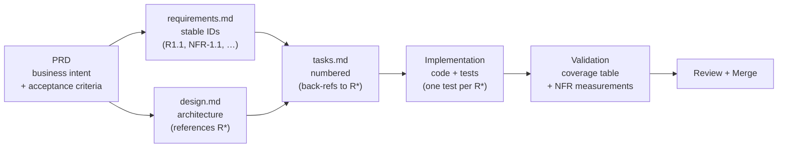

# SpecForge

**An open-source framework for spec-driven agentic software engineering — vendor-neutral across Claude Code, Codex, Gemini CLI, Kiro, Cursor, and Windsurf.**

SpecForge captures production-grade patterns for PRDs, specifications, prompts, agents, skills, slash commands, hooks, workflows, and engineering rules. It is content, not an application: drop the templates and runtime layouts into your own repo and adapt them to your stack.

## Why spec-driven agentic coding

Agent-assisted development drifts when there is no contract for *what* is being built. SpecForge formalizes the flow:



Each stage has a template, an agent assignment, and an acceptance criterion. The cross-references that survive across stages — stable requirement IDs, design `Satisfies:` annotations, task back-refs, test back-refs — are what make the agent's output reviewable.

## Core artifact taxonomy

| Artifact | What it is | Lives in |
|---|---|---|
| **PRD** | Business intent, goals, scope, success metrics | `prds/` |
| **Spec** | Requirements + design + tasks (or single feature spec) | `specs/` |
| **Agent** | Defined role + model + tools, invokable by a runtime | `agents/` |
| **Skill** | Interactive parameterized workflow (`SKILL.md` per skill) | `skills/` |
| **Command** | Simple slash-invoked operation, vendor-specific shape | `commands/` |
| **Hook** | Event-triggered automation (file-edit, pre-commit, session-start) | `hooks/` |
| **Prompt** | Reusable prompt — global master, phase master, or task | `prompts/` |
| **Workflow** | End-to-end execution model | `workflows/` |
| **Rule** | Engineering standard, vendor-specific or shared | `rules/` |

When to reach for which: see [`docs/automation-decision-framework.md`](docs/automation-decision-framework.md).

## Supported vendor matrix

| Vendor | Runtime dir | Root context file | Skills | Agents | Commands | Hooks | MCP config |
|---|---|---|---|---|---|---|---|
| Claude Code | `.claude/` | `CLAUDE.md` | folder-per-skill `SKILL.md` | flat `<name>.md` + frontmatter | `commands/<name>.md` | `hooks/hooks.json` | `claude_desktop_config.json` |
| Codex | `.codex/` | `AGENTS.md` | folder-per-skill `SKILL.md` | flat `<name>.md` | via skills (`user-invocable: true`) | — | `config.toml [mcp_servers]` |
| Gemini CLI | `.gemini/` | `GEMINI.md` (delegation shim) | — | — | `gemini_cli_config.json` | — | `settings.json [mcpServers]` |
| Kiro | `.kiro/` | `steering/` files | — | — | — | `*.kiro.hook` | — |
| Cursor | `.cursor/rules/` | `.cursorrules` | — | — | — | — | — |
| Windsurf | `.windsurf/rules/` | — | — | — | — | — | — |

Vendor neutrality is the contract: adding a new tool means a new column, not a fork.

## Getting started

1. **Read the philosophy** — [`docs/philosophy.md`](docs/philosophy.md), [`docs/spec-driven-development.md`](docs/spec-driven-development.md), [`docs/agentic-coding-model.md`](docs/agentic-coding-model.md).
2. **Pick your vendors** — copy the relevant `runtimes/.<vendor>/` directories into your own repo.
3. **Pick a starting artifact** — PRD template for a new feature, spec triplet for an existing one, agent roster template for a new team.
4. **Walk the worked example** — [`examples/sample-feature/`](examples/sample-feature/) shows every artifact shape end-to-end (PRD, requirements, design, tasks, agent roster, phased prompts, implementation plan).

## Repository structure

```
specforge/
├── docs/         framework documentation (philosophy, decision frameworks, integrations)
├── prds/         product requirements + lifecycle (active / deprecated / archive)
├── specs/        spec triplet templates (requirements, design, tasks)
├── agents/       agent template, archetypes, examples, cross-vendor roster
├── skills/       skill-template/SKILL.md and folder-per-skill examples
├── commands/     vendor-specific slash command templates
├── hooks/        event-triggered automation (Claude hooks.json, Kiro .kiro.hook)
├── prompts/      codex/, claude/, shared/ prompt patterns and master-prompt templates
├── workflows/    end-to-end engineering execution models
├── rules/        per-vendor and shared engineering rules
├── runtimes/     copy-pasteable .claude/, .codex/, .gemini/, .kiro/, .cursor/, .windsurf/ layouts
├── examples/     sample-feature/ — canonical worked example
├── tools/        cross-vendor sync utilities
└── assets/
```

## Contributing

See [`CONTRIBUTING.md`](CONTRIBUTING.md) for contribution guidelines and [`CODE_OF_CONDUCT.md`](CODE_OF_CONDUCT.md) for community standards. Security issues: see [`SECURITY.md`](SECURITY.md).

## Roadmap

See [`ROADMAP.md`](ROADMAP.md).

## License

[Apache 2.0](LICENSE).
